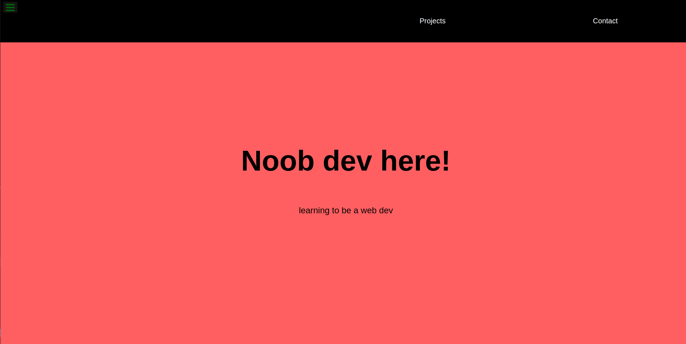

# FCC-Portfolio_page

> Protfolio page create on the basis of user stories provided by FCC challenge.

To claim FCC certificate I completed the final project that helped me to create a protfolio page.

## Built With

- HTML & CSS
- none for now
- Linters and VS Code

## Live Demo

[Live Demo Link](https://raovikrant82.github.io/FCC-Portfolio_page/)

## Authors

👤 **Author**

- GitHub: [@raovikrant82](https://github.com/raovikrant82)
- Twitter: [@Imvikrantrao](https://twitter.com/Imvikrantrao)

## 🤝 Contributing

Contributions, issues, and feature requests are welcome!

Feel free to check the [issues page](../../issues/).

## Show your support

Give a ⭐️ if you like this project!

## 📝 License

This project is [MIT](./MIT.md) licensed.
